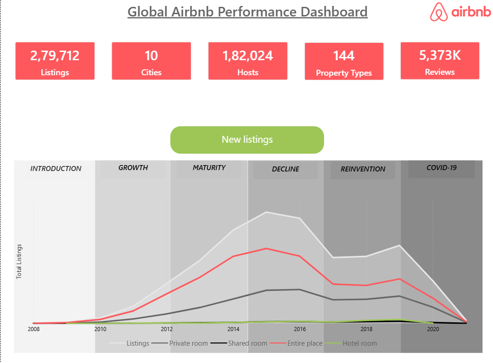
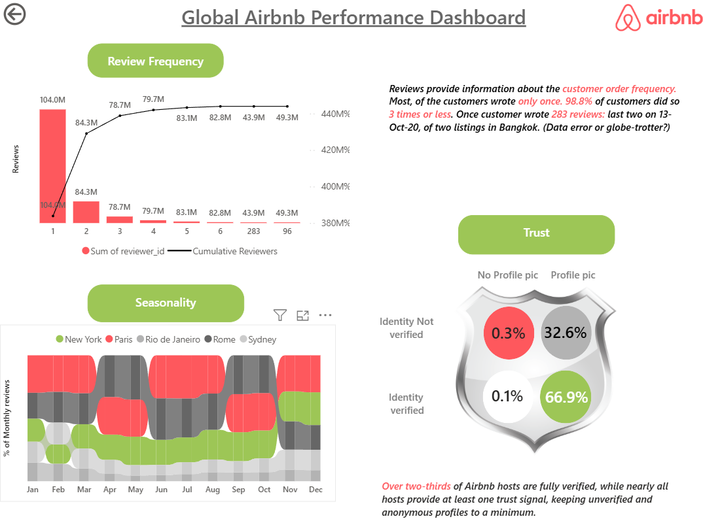
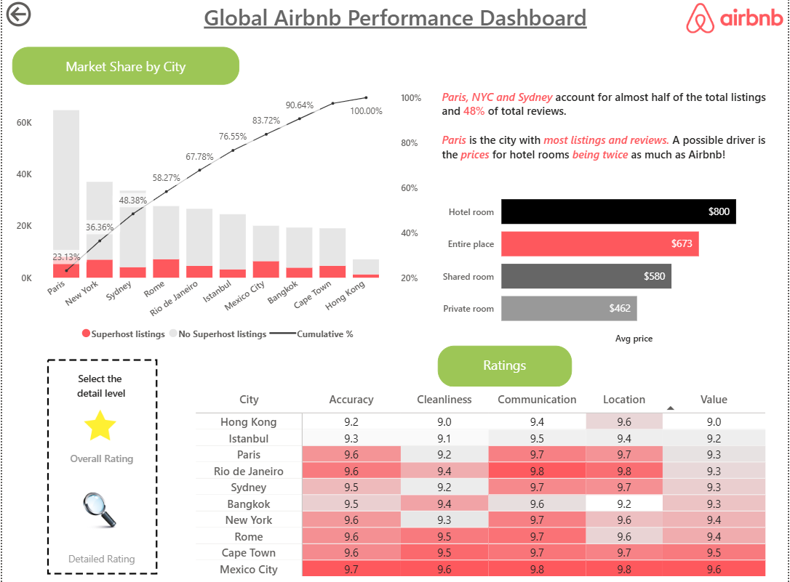

🏠 Global Airbnb Performance Dashboard – Power BI

📝 Short Description
This project analyzes Airbnb listing performance across global cities using interactive dashboards built in Power BI.  
It provides insights into listings growth, pricing trends, review behavior, and host trust metrics.

Tech Stack
- 📊 Microsoft Power BI  
- 📈 DAX  
- 📑 Excel / CSV Dataset  

 Features and Highlights
- 📊 Interactive multi-page Power BI dashboard  
- 📌 KPI cards (Listings, Hosts, Reviews, Cities, Property Types)  
- 📈 Growth analysis of listings over time  
- 🌍 Market share comparison across cities  
- ⭐ Review frequency and customer behavior insights  
- 🔐 Host trust analysis (verified vs non-verified)  
- 🎛️ Slicers and navigation buttons for better user experience  

Example Insights
The dashboard provides insights such as:
- 🏙️ Paris, NYC, and Sydney dominate listings and reviews  
- 📉 Most users write only 1–2 reviews  
- 💰 Hotel rooms are significantly more expensive than Airbnb listings  
- 🔐 Majority of hosts are verified and have profile pictures  

Key Questions Answered
- Which cities contribute the most to listings and reviews?  
- How does Airbnb growth change over time?  
- What is the distribution of reviews per user?  
- How trustworthy are hosts based on verification and profile data?  
- What are the pricing differences across property types?  

🖼️ Screenshots / Demo

📊 Overview & Growth Dashboard

📉 Review Frequency & Trust Analysis

🌍 Market Share & Ratings

🚀 Project Workflow
1. Data cleaning and preparation  
2. Data modeling in Power BI  
3. Creating calculated measures using DAX  
4. Designing interactive dashboard pages  
5. Adding navigation and storytelling elements  

 Live Dashboard
Live Dashboard Link: 

Conclusion
This dashboard helps understand Airbnb business performance, customer behavior, and host reliability.  
It supports data-driven decision-making through clear and interactive visualizations.
